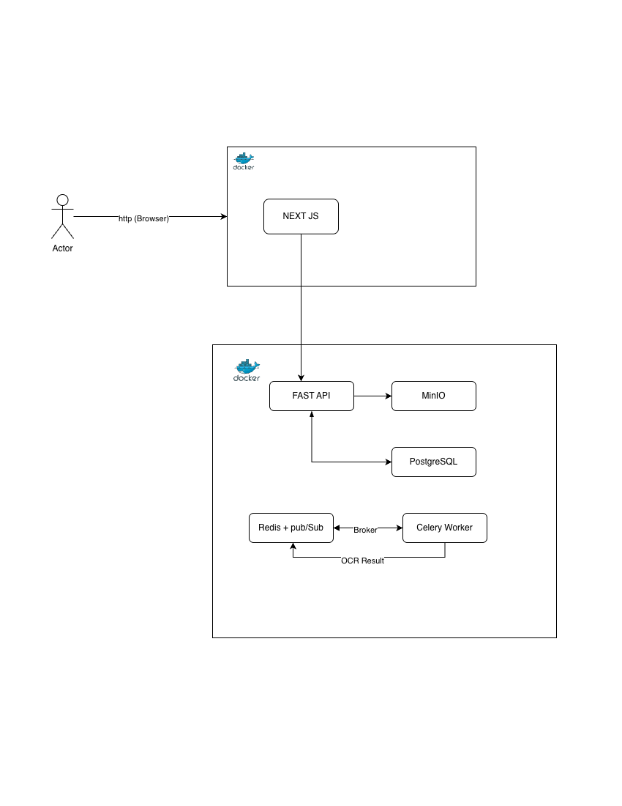

# Plataforma OCR de Documentos

Plataforma web para subir documentos (JPG, PNG, PDF), procesarlos con OCR en background y visualizar el texto extraído.

---

## Tabla de contenidos

1. [Instrucciones de ejecución](#1-instrucciones-de-ejecución)
2. [Arquitectura](#2-arquitectura)
3. [Diseño de API](#3-diseño-de-api)

---

## 1. Instrucciones de ejecución

### Prerrequisitos

| Herramienta | Versión mínima |
|-------------|----------------|
| Docker | 24.x |
| Docker Compose | v2.x |


### Estructura del proyecto

```
platform_ocr/
├── backend/
│   ├── docker-compose.yml   # postgres, redis, minio, API, celery worker
│   ├── .env                 # variables del backend
│   ├── Dockerfile
│   └── app/
└── frontend/
    ├── docker-compose.yml   # Next.js
    ├── Dockerfile
    └── src/
```

### Configuración inicial

Cada subcarpeta tiene su propio `.env`. Edita los valores antes de levantar los servicios.

**`backend/.env`**

| Variable | Descripción | Valor por defecto |
|----------|-------------|-------------------|
| `POSTGRES_USER` | Usuario de PostgreSQL | `ocr` |
| `POSTGRES_PASSWORD` | Contraseña de PostgreSQL | `ocr_pass` |
| `POSTGRES_DB` | Nombre de la base de datos | `ocr_db` |
| `MINIO_ROOT_USER` | Usuario root de MinIO | `minioadmin` |
| `MINIO_ROOT_PASSWORD` | Contraseña root de MinIO | `minioadmin123` |
| `MINIO_BUCKET` | Bucket donde se guardan los archivos | `documents` |
| `SECRET_KEY` | Clave para firmar JWTs | *(cambiar en producción)* |
| `ALGORITHM` | Algoritmo JWT | `HS256` |
| `ACCESS_TOKEN_EXPIRE_MINUTES` | TTL del token JWT en minutos | `60` |
| `SEED_ADMIN_USERNAME` | Identificador del admin inicial | `admin` |
| `SEED_ADMIN_PASSWORD` | Contraseña del admin inicial | `admin123` |
| `OCR_PROVIDER` | Motor de extracción: `tesseract`, `openai` o `anthropic` | `tesseract` |
| `OPENAI_API_KEY` | API key de OpenAI (solo si `OCR_PROVIDER=openai`) | — |
| `OPENAI_MODEL` | Modelo de OpenAI a usar | `gpt-4o` |


### Levantar el proyecto

Todos los comandos se ejecutan desde la **raíz del proyecto**. Docker Compose carga automáticamente el `.env` de la carpeta donde vive el archivo compose.

**Primera vez (o tras modificar código):**

```bash
# 1. Iniciar el backend
docker compose -f backend/docker-compose.yml up --build -d

# 2. Iniciar el frontend
docker compose -f frontend/docker-compose.yml up --build -d
```

**Las siguientes veces** (sin cambios de código):

```bash
docker compose -f backend/docker-compose.yml up -d
docker compose -f frontend/docker-compose.yml up -d
```

### URLs disponibles

| Servicio | URL | Credenciales |
|----------|-----|--------------|
| Frontend | http://localhost:3000 | — |
| API REST | http://localhost:8000 | — |
| Swagger UI | http://localhost:8000/docs | — |
| MinIO Console | http://localhost:9001 | `minioadmin` / `minioadmin123` |


### Detener el proyecto

```bash
# Detener los contenedores (sin borrar datos)
docker compose -f backend/docker-compose.yml down
docker compose -f frontend/docker-compose.yml down

# Detener el backend y eliminar volúmenes (borra base de datos y archivos MinIO)
docker compose -f backend/docker-compose.yml down -v
```

### Reconstruir un servicio individual

```bash
# Solo el backend API
docker compose -f backend/docker-compose.yml up --build -d backend

# Solo el worker Celery
docker compose -f backend/docker-compose.yml up --build -d celery_worker

# Solo el frontend
docker compose -f frontend/docker-compose.yml up --build -d
```

### Entorno de desarrollo local (opcional)

Para ejecutar el backend fuera de Docker (requiere Python 3.11):

```bash
cd backend

python3.11 -m venv .venv
source .venv/bin/activate
pip install -r requirements.txt

# Levantar solo la infraestructura
docker compose -f backend/docker-compose.yml up postgres redis minio -d

# Iniciar el servidor (pydantic-settings lee backend/.env automáticamente)
uvicorn app.main:app --reload

# En otra terminal, iniciar el worker Celery
celery -A app.tasks.celery_app worker --loglevel=info -Q ocr,celery
```

---

## 2. Arquitectura

### Diagrama de servicios




### Descripción de cada servicio

| Servicio | Rol |
|----------|-----|
| **FastAPI** | API REST + endpoints SSE. Gestiona autenticación JWT, sube archivos a MinIO, persiste metadata en PostgreSQL y manda tareas a Celery. |
| **Next.js** | SPA (Single Page Application) del lado del cliente. Toda la lógica de datos corre en el browser. |
| **PostgreSQL** | Base de datos. |
| **MinIO** | Almacena los archivos binarios en un bucket organizados como `{user_id}/{doc_id}/{filename}`. |
| **Redis** | Doble uso: (1) broker/backend de Celery y (2) canal pub/sub para notificar cambios de estado a los clientes SSE. |
| **Celery Worker** | Proceso independiente que descarga el archivo de MinIO, ejecuta Tesseract u otro procesador para decodificar archivo, actualiza PostgreSQL y publica en Redis. |

### Flujo completo de un documento

```
1. Usuario sube archivo
   │
   ├─ FastAPI valida tipo/tamaño
   ├─ Sube binario a MinIO  →  {user_id}/{doc_id}/{filename}
   ├─ Crea registro en PostgreSQL  →  status = "uploaded"
   ├─ Despacha tarea Celery (.delay())  →  obtiene task_id
   └─ Actualiza registro  →  status = "queued", celery_task_id = task_id

2. Celery Worker recibe la tarea
   │
   ├─ Verifica que el documento no fue cancelado
   ├─ Actualiza PostgreSQL  →  status = "processing"
   ├─ Publica en Redis  →  canal doc:{id}  →  {status: "processing"}
   ├─ Descarga archivo de MinIO
   ├─ Ejecuta OCR (Tesseract; pdf2image para PDFs)
   ├─ Actualiza PostgreSQL  →  status = "completed", ocr_text = "..."
   └─ Publica en Redis  →  {status: "completed", ocr_text: "..."}

3. Frontend recibe actualizaciones
   │
   ├─ Abre EventSource  →  GET /documents/{id}/stream?token=...
   ├─ Endpoint suscribe al canal Redis doc:{id}
   ├─ Envía estado actual inmediatamente (evita race condition)
   └─ Retransmite mensajes Redis como eventos SSE hasta estado terminal
```

### Ciclo de vida de estados

```
uploaded ──► queued ──► processing ──► completed
                │                   └──► failed
                └──► cancelled
```

| Estado | Descripción |
|--------|-------------|
| `uploaded` | Archivo recibido, metadata guardada |
| `queued` | Tarea enviada a la cola de Celery |
| `processing` | Worker ejecutando OCR |
| `completed` | OCR exitoso, texto disponible |
| `failed` | Error durante el procesamiento (reintentos agotados) |
| `cancelled` | Cancelado por el usuario antes de ser procesado |

### Comentarios sobre el diseño

**Dos archivos Docker Compose separados** — el backend y el frontend se gestionan de forma independiente. Esto permite reconstruir o reiniciar el frontend sin afectar a PostgreSQL, Redis o MinIO, y viceversa. La carpeta del backend tiene el archivo `.env` para guardar las variables que le corresponden.

**SSE en lugar de WebSocket** — la actualización de estado es unidireccional (servidor → cliente). SSE es el primitivo correcto para este caso: más simple, funciona sobre HTTP/1.1 y no requiere infraestructura adicional.

**Token JWT en query param para SSE** — la API `EventSource` del browser no soporta headers personalizados. El token se pasa como `?token=…` únicamente en este endpoint; todos los demás usan el header `Authorization: Bearer`.

**Suscripción antes de consultar estado actual** — el endpoint SSE suscribe al canal Redis *antes* de leer el estado del documento en PostgreSQL. Esto elimina la ventana de race condition donde la tarea podría completarse entre la lectura del estado y la suscripción.

**SQLAlchemy síncrono (psycopg2) en el worker Celery** — Celery usa un modelo de concurrencia prefork (`os.fork()`). Los drivers async como `asyncpg` vinculan su pool de conexiones al event loop del proceso padre, que queda inválido después del fork. El worker usa un engine síncrono con `NullPool` y `psycopg2`, que no comparte estado entre procesos. La API FastAPI sigue usando `asyncpg` sin cambios.

**Cancelación con revocación de tarea** — al cancelar, se llama a `celery.control.revoke(task_id)` para que el worker no procese la tarea si aún no la tomó. Si ya la tomó, el worker lee el estado al inicio y retorna sin procesar.

**Proveedor de extracción configurable** — la variable `OCR_PROVIDER` en `backend/.env` decide el motor sin tocar el código:

| Valor | Motor | Costo | Ideal para |
|-------|-------|-------|-----------|
| `tesseract` | Tesseract local | Gratis | Documentos digitales con texto limpio |
| `openai` | GPT-4o Vision | Por llamada | Documentos complejos, múltiples idiomas |
| `anthropic` | Claude (Opus/Sonnet) | Por llamada | Documentos complejos, razonamiento sobre el contenido |

El punto de intercambio está en `_run_ocr()` dentro de `app/tasks/ocr.py`. Agregar un nuevo proveedor solo requiere añadir una función `_run_<nombre>()` y un caso en el dispatcher.

**Autenticación por email** — el campo de registro e inicio de sesión acepta correo electrónico. El valor se normaliza a minúsculas antes de guardarse y compararse, lo que evita duplicados por diferencias de capitalización.

**Logging estructurado (JSON)** — todos los eventos relevantes (login, registro, subida, cancelación, OCR, errores, violaciones de ownership) se emiten en formato JSON para facilitar la ingesta en herramientas de observabilidad (Datadog, Loki, CloudWatch, etc.).

**Tabla de Auditoria** - Tabla dentro de la Base de Datos para registrar los distintos procesos como eliminar un documento o subir un documento para tener un log de Trazabilidad entre usuarios y documentos.

---

## 3. Diseño de API

### Autenticación

La API usa **JWT Bearer tokens** (algoritmo HS256, TTL 60 min).

Todas las rutas excepto `POST /auth/login` y `POST /auth/register` requieren el header:

```
Authorization: Bearer <token>
```

El endpoint SSE (`/documents/{id}/stream`) es la única excepción: recibe el token como query param `?token=<token>` porque la API `EventSource` del browser no permite headers.

---

### Endpoints

#### `POST /auth/register`

Registra un nuevo usuario.

**Body**
```json
{
  "email":    "usuario@ejemplo.com",
  "password": "string"
}
```

**Respuesta exitosa** `201 Created`
```json
{
  "id":       "uuid",
  "username": "usuario@ejemplo.com"
}
```

**Errores**
| Código | Motivo |
|--------|--------|
| `409 Conflict` | Email ya registrado |
| `422 Unprocessable Entity` | Email inválido o contraseña menor a 8 caracteres |

---

#### `POST /auth/login`

Autentica un usuario y devuelve un JWT.

**Body**
```json
{
  "email":    "usuario@ejemplo.com",
  "password": "string"
}
```

**Respuesta exitosa** `200 OK`
```json
{
  "access_token": "eyJ...",
  "token_type":   "bearer"
}
```

**Errores**
| Código | Motivo |
|--------|--------|
| `401 Unauthorized` | Credenciales inválidas |

---

#### `GET /documents/`

Lista todos los documentos del usuario autenticado, ordenados por fecha de creación descendente.

**Respuesta exitosa** `200 OK`
```json
[
  {
    "id":                "uuid",
    "original_filename": "contrato.pdf",
    "file_size":         204800,
    "mime_type":         "application/pdf",
    "status":            "completed",
    "ocr_text":          "Lorem ipsum...",
    "error_message":     null,
    "created_at":        "2024-01-15T10:30:00",
    "updated_at":        "2024-01-15T10:30:45"
  }
]
```

---

#### `POST /documents/`

Sube un documento, lo almacena en MinIO, persiste la metadata y despacha la tarea OCR.

**Body** `multipart/form-data`

| Campo | Tipo | Descripción |
|-------|------|-------------|
| `file` | file | Archivo JPG, PNG o PDF (máx. 10 MB) |

**Respuesta exitosa** `201 Created`

Devuelve el objeto documento con `status = "queued"`.

**Errores**
| Código | Motivo |
|--------|--------|
| `415 Unsupported Media Type` | Tipo de archivo no permitido |
| `413 Request Entity Too Large` | Archivo supera 10 MB |

---

#### `GET /documents/{id}`

Obtiene el detalle de un documento, incluyendo el resultado OCR si está disponible.

**Respuesta exitosa** `200 OK`

Mismo esquema que los elementos del listado.

**Errores**
| Código | Motivo |
|--------|--------|
| `404 Not Found` | Documento no existe o pertenece a otro usuario |


---

#### `POST /documents/{id}/cancel`

Cancela el procesamiento de un documento que aún no haya comenzado.

Solo es posible si el estado actual es `uploaded` o `queued`.

**Respuesta exitosa** `200 OK`

Devuelve el objeto documento con `status = "cancelled"`.

**Errores**
| Código | Motivo |
|--------|--------|
| `404 Not Found` | Documento no existe o pertenece a otro usuario |
| `409 Conflict` | El documento ya está en `processing`, `completed`, `failed` o `cancelled` |

---

#### `DELETE /documents/{id}`

Elimina el documento de MinIO y PostgreSQL. (eliminado Logico)

**Respuesta exitosa** `204 No Content`

**Errores**
| Código | Motivo |
|--------|--------|
| `404 Not Found` | Documento no existe o pertenece a otro usuario |

---

#### `GET /documents/{id}/stream?token={jwt}`

Endpoint SSE. Transmite actualizaciones de estado en tiempo real hasta que el documento alcanza un estado terminal (`completed`, `failed` o `cancelled`).

**Query params**

| Param | Tipo | Descripción |
|-------|------|-------------|
| `token` | string | JWT de acceso (requerido, no puede ir en header) |

**Formato del stream**

Cada evento sigue el formato estándar SSE:

```
data: {"status": "processing", "ocr_text": null, "error_message": null}

data: {"status": "completed", "ocr_text": "Texto extraído...", "error_message": null}

```


El stream termina automáticamente al recibir un estado terminal.

**Errores**
| Código | Motivo |
|--------|--------|
| `401 Unauthorized` | Token inválido o expirado |
| `404 Not Found` | Documento no existe o pertenece a otro usuario |

---

### Esquema de documento

```json
{
  "id":                "string (UUID)",
  "original_filename": "string",
  "file_size":         "integer (bytes)",
  "mime_type":         "string (image/jpeg | image/png | application/pdf)",
  "status":            "string (uploaded | queued | processing | completed | failed | cancelled)",
  "ocr_text":          "string | null",
  "error_message":     "string | null",
  "created_at":        "string (ISO 8601)",
  "updated_at":        "string (ISO 8601)"
}
```

### Tipos de archivo soportados

| MIME type | Extensión | Procesamiento OCR |
|-----------|-----------|-------------------|
| `image/jpeg` | `.jpg`, `.jpeg` | Tesseract directo |
| `image/png` | `.png` | Tesseract directo |
| `application/pdf` | `.pdf` | pdf2image (200 dpi/página) → Tesseract por página |

### Límites

| Parámetro | Valor |
|-----------|-------|
| Tamaño máximo de archivo | 10 MB |
| TTL del token JWT | 60 minutos |
| Reintentos OCR ante fallo | 2 (con delay de 10 s) |
| Concurrencia del worker | 2 tareas en paralelo |
